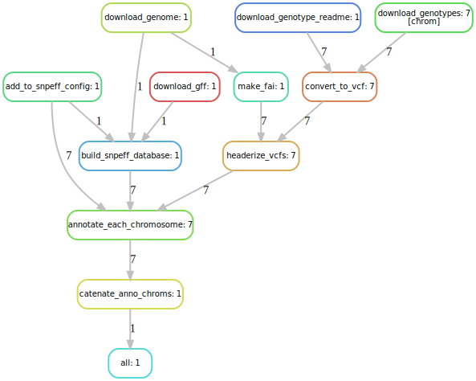

annotate-millet-variants-snakeflow
================

This is a little Snakemake workflow to annotate some variants from pearl
millet. This task came up during a bioinformatics course, BZ582A, at CSU
in the spring of 2022. SnpEff is pretty easy to use when there is a
precompiled data base for your organism. It is a little clunkier when
you need to build a data base from a GFF. This shows one approach to
that. (Note that it would probably be good to check the results by
comparing them to some coding sequences, which we have not done here,
yet).

The purpose of this little workflow is to demonstrate how a Snakefile
can be put together for this task, and also to show how to use a SLURM
profile derived from jdblischak’s
[smk-simple-slurm](https://github.com/jdblischak/smk-simple-slurm)
profile. The profile included in the repository at
`/hpcc-profiles/slurm-summit` is tailored to the SUMMIT supercomputer.

Here is a DAG of this workflow, condensed using
[SnakemakeDagR](https://github.com/eriqande/SnakemakeDagR):
<!-- -->

To try this out on SUMMIT:

1.  From `scompile` clone this repository from GitHub into your scratch
    directory.

``` sh
git clone https://github.com/eriqande/annotate-millet-variants-snakeflow.git
```

2.  Then, on the `scompile` node, first do a dry run:

``` sh
conda activate snakemake
snakemake -np 
```
